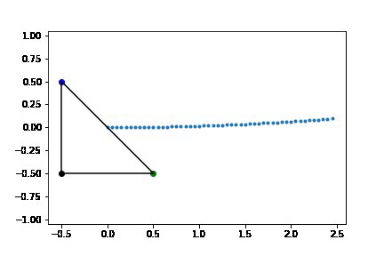
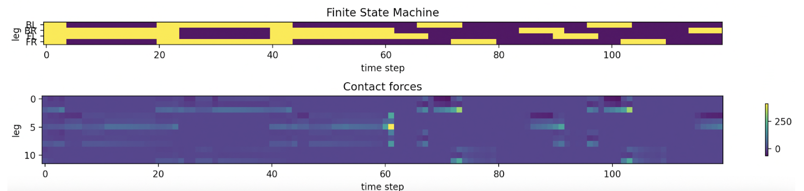
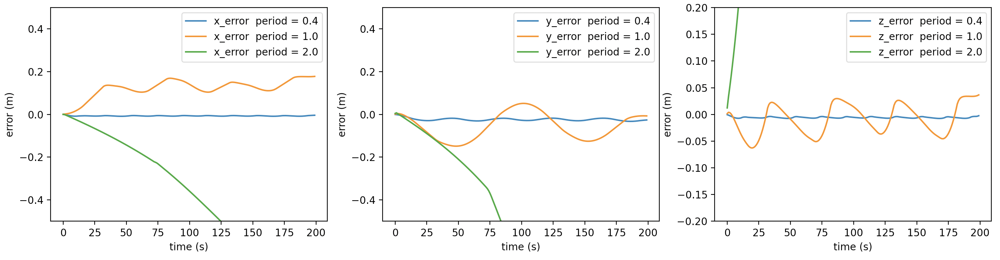

# gait-trans
Optimal quadruped gait transitions

## About

Final project for MEAM 517 - Control And Optimization With Applications In Robotics, Fall 2022.

Members: [Chandravaran Kunjeti](https://github.com/chandravaran), [Jason Xie](https://github.com/JChunX)

We are interested in the problem of transitioning between two different gaits for a quadruped robot. Using an existing convex MPC method, we extend it to handle gait transitions by running multiple MPCs covering potential next gait states.

## Results

### Footstep Planner



### Gait Transitions



### Effect of Varying Gait Periods



## Run

```bash
source gait_trans/drakeenv/bin/activate

python main.py
```